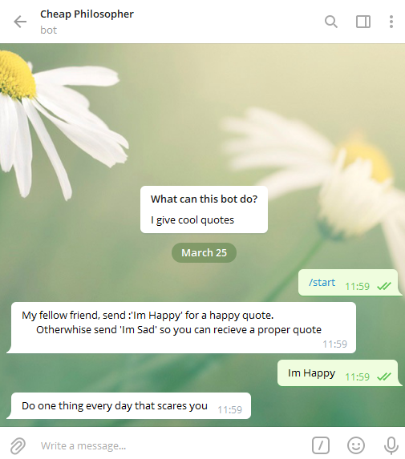
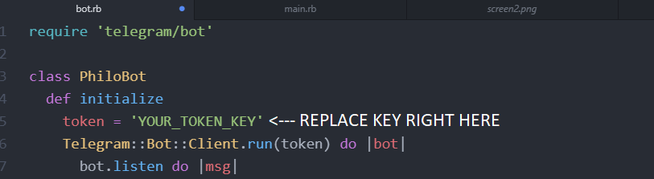

# Telegram Philosophy Bot
The following is a telegram bot that sends you cheap philosophy quotes that are different depending if you tell him that you are happy or you are sad.

## Built With
- Ruby
- Rubocop
- Ruby's Telegram Gem

## Screenshots

### Prerequisites

- Telegram Account

### Setup
- Open Terminal
- Run git clone https://github.com/KennyUTN/Bot-Telegram.git

- Go to this telegram link [here](https://t.me/botfather) and create a new Bot (Username and token). [precise instructions here](https://core.telegram.org/bots#6-botfather)

- Go to lib/bot.rb and replace the "YOUR_TOKEN_KEY" line with your newly created token
   
- Run `cd Bot-Telegram`

- Run `ruby bin/main`

## Steps to validate code using Rspec
- Once you have clone the repository make sure that you have Rspec install by running rspec --version
- If you do not have Rspec installed do so by following the Instructions [here](https://medium.com/@amliving/my-rails-rspec-set-up-6451269847f9)
- Then move to the directory spec and run this command 'rspec bot_spec.rb'

### Authors

👤 **Juan Ignacio Asis**

- Github: [@KennyUTN](https://github.com/Berabjesus)
- Twitter: [@Kenny11614766](https://twitter.com/Kenny11614766)
- Linkedin: [Ignacio Asis](https://www.linkedin.com/in/ignacio-asis-b8214b183/)

## 🤝 Contributing

Contributions, issues and feature requests are welcome!

Feel free to check the [issues page](https://github.com/KennyUTN/Bot-Telegram).

## Show your support

Give a ⭐️ if you like this project!

## Acknowledgments

- GitHub
- TheOdinProject
- Ruby

## 📝 License

This project is [MIT](lic.url) licensed.
